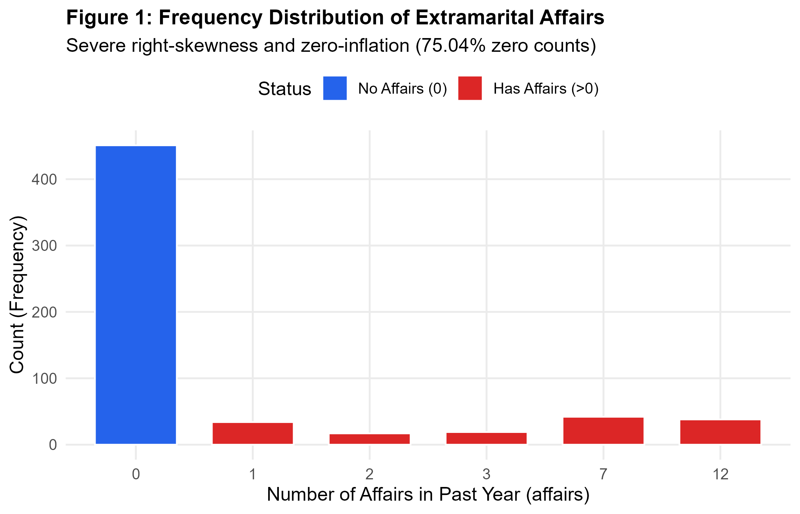
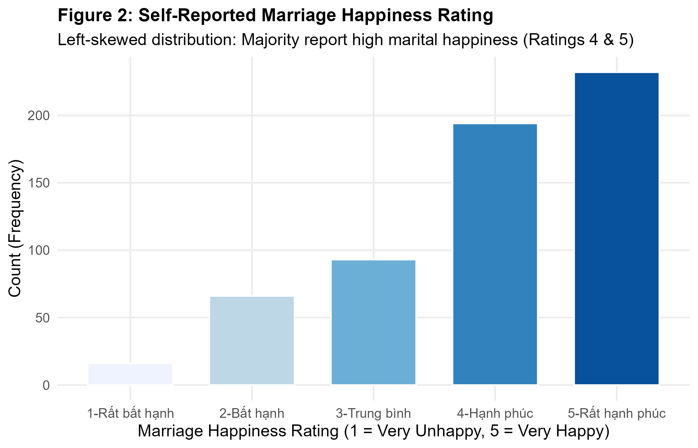
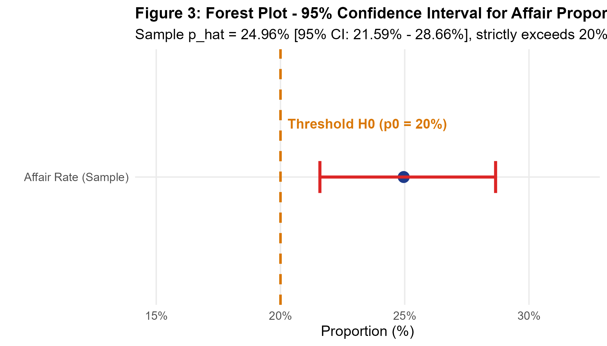
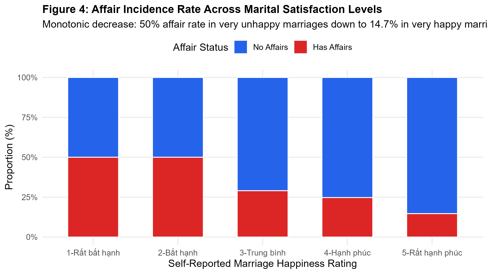
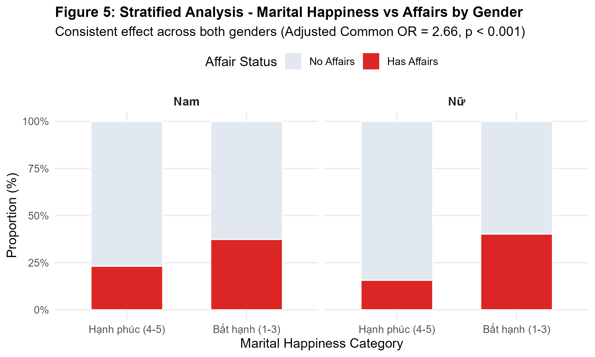
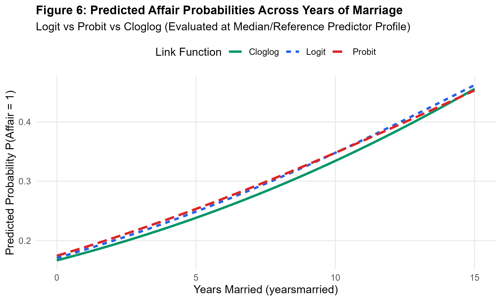
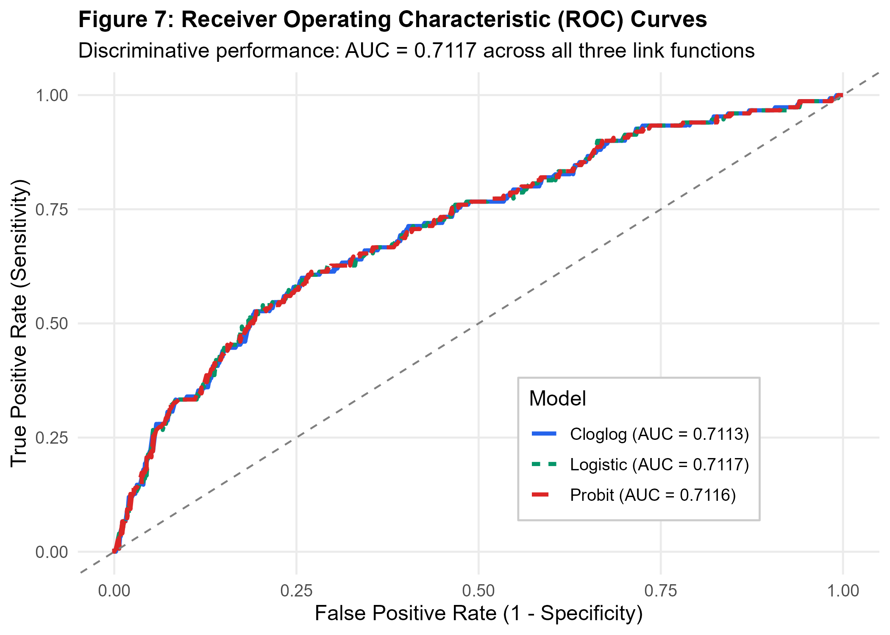
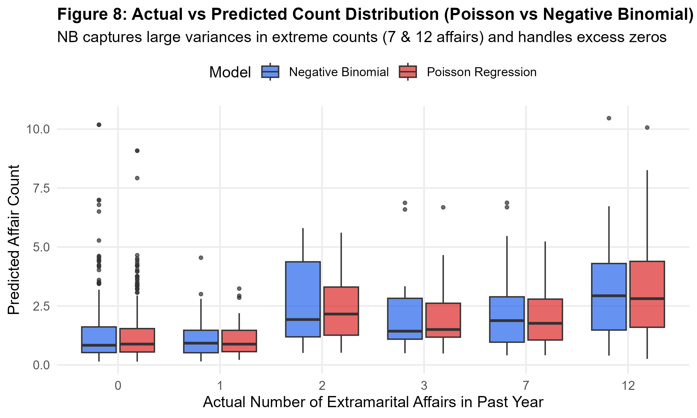

# 📊 Econometric Modeling of Extramarital Decisions: Categorical & Count Data GLM Framework

[](https://www.r-project.org/)
[](#econometric-methodology)
[%20%5Bn%3D601%5D-blue.svg)](https://www.jstor.org/stable/1831092)
[](LICENSE)

> **Quantitative Portfolio Project**: Applied Econometrics & Categorical Data Analysis demonstrating binary choice modeling, count data risk modeling, overdispersion diagnostics, stratified association testing, and multidimensional log-linear models.

---

## 📌 Executive Summary

In quantitative risk analysis, financial modeling, and behavioural economics, analysts frequently encounter **non-Gaussian, discrete, bounded, or count-dependent outcomes**—such as credit default events, operational incident frequencies, or insurance claims. Standard Ordinary Least Squares (OLS) regressions fail under these conditions due to non-normality, heteroskedasticity, and probability boundary violations.

This project delivers an end-to-end econometric investigation into **decision and frequency modeling** using the classic dataset by **Professor Ray C. Fair (1978, *Journal of Political Economy*)** ($n = 601$).

### Key Analytical Achievements
1. **Binary Choice Modeling ($Y \in \{0, 1\}$)**: Formulated and benchmarked **Logit**, **Probit**, and **Cloglog** Generalized Linear Models (GLMs). Model discrimination achieved **$\text{AUC} = 0.7117$**.
2. **Overdispersion Correction in Count Data ($Y \in \mathbb{N}_0$)**: Applied **Cameron & Trivedi (1990) score test**, confirming severe overdispersion ($\hat{\alpha} = 6.9430, Z = 5.2863, p < 0.001$). Proved the superiority of **Negative Binomial (NB)** over Poisson regression, cutting **$\text{AIC}$ from $2877.99$ to $1475.10$** ($\Delta \text{AIC} = -1402.89$).
3. **Stratified Invariance Testing**: Executed **Mantel-Haenszel test**, demonstrating that marital unhappiness elevates the odds of extramarital involvement by **$2.66\times$** ($p < 0.001$) consistently across genders without Simpson's paradox.
4. **Theoretical Equivalence Proof**: Empirically proved the mathematical equivalence between the 2-way interaction parameter in a **Homogeneous Association Log-Linear Model** ($\lambda = 0.9842$) and the slope coefficient in **Conditional Logistic Regression** ($\beta = 0.9842$).

---

## 📂 Repository Structure

```text
├── .gitignore                          # Standard R / Quarto / IDE ignore rules
├── README.md                           # Comprehensive quantitative portfolio documentation
├── QuynhMy.qmd                         # Full Quarto academic research paper (Vietnamese)
├── data/
│   ├── raw/
│   │   └── Affairs.csv                 # Raw dataset (Fair, 1978 via AER/Rdatasets)
│   └── processed/
│       ├── affairs_cleaned.csv         # Cleaned & engineered dataset (CSV)
│       ├── affairs_cleaned.rds         # Serialized clean dataset (RDS)
│       └── models.rds                  # Serialized fitted GLM model objects
├── figures/                            # High-resolution output charts (300 DPI)
│   ├── fig1_affairs_distribution.png
│   ├── fig2_rating_distribution.png
│   ├── fig3_forest_plot_ci.png
│   ├── fig4_rating_affairs_stacked.png
│   ├── fig5_mosaic_plot.png
│   ├── fig6_predicted_probabilities.png
│   ├── fig7_roc_curves.png
│   └── fig8_count_models_comparison.png
└── scripts/                            # Modular, production-ready R scripts
    ├── 01_data_cleaning.R              # Ingestion, validation & factor encoding
    ├── 02_descriptive_and_inference.R  # Descriptive stats, CI estimation & Z-test
    ├── 03_contingency_and_stratified.R # Crosstabs, Chi-square, OR/RR, Mantel-Haenszel
    ├── 04_binary_and_count_models.R    # Binary GLMs, Overdispersion test, Count GLMs
    ├── 05_model_evaluation.R           # Goodness-of-fit, Confusion matrix, ROC/AUC
    ├── 06_loglinear_and_equivalence.R  # 3-Way Log-linear models & Equivalence proof
    └── run_all.R                       # Master pipeline orchestrator
```

---

## 🔬 Data Overview & Variable Dictionary

The study utilizes survey data collected from $601$ married individuals originally gathered by *Psychology Today* and *Redbook* (Fair, 1978).

| Variable | Role in Model | Measurement Scale | Description | Sample Distribution / Mean |
| :--- | :--- | :--- | :--- | :--- |
| `affairs` | Target (Count) | Discrete Count | Number of extramarital affairs in the past year | Range: $[0, 12]$, $75.04\%$ zero counts |
| `has_affair` | Target (Binary) | Binary Factor | Indicator: $1$ if `affairs` $> 0$, $0$ otherwise | `No`: $75.04\%$ ($n=451$), `Yes`: $24.96\%$ ($n=150$) |
| `rating` | Predictor | Ordinal (1–5) | Self-assessed marriage happiness ($1=\text{Very unhappy}, 5=\text{Very happy}$) | Median: $4.00$, Mode: $5$ ($38.6\%$) |
| `yearsmarried` | Predictor | Ratio / Continuous | Number of years married | Mean: $8.18$ yrs ($SD = 5.57$, range: $0.125 - 15$) |
| `age` | Predictor | Continuous | Age of the respondent | Mean: $32.49$ yrs ($SD = 9.29$, range: $17.5 - 57$) |
| `religiousness` | Predictor | Ordinal (1–5) | Level of religiousness ($1=\text{Anti/None}, 5=\text{Very religious}$) | Mean: $3.12$, Median: $3.00$ |
| `education` | Predictor | Continuous | Years of formal education | Mean: $16.17$ yrs ($SD = 2.41$) |
| `gender` | Control / Stratum | Nominal Factor | Gender of respondent (`male` / `female`) | `Male`: $47.59\%$ ($n=286$), `Female`: $52.41\%$ ($n=315$) |
| `children` | Control | Binary Factor | Presence of children (`yes` / `no`) | `Yes`: $71.55\%$ ($n=430$), `No`: $28.45\%$ ($n=171$) |

<p align="center">
  
  
</p>

---

## 📈 Empirical Results & Statistical Highlights

### 1. One-Sample Proportion & Success-Failure Validation
- **Sample Proportion**: $\hat{p} = \frac{150}{601} = 24.96\%$ with $SE = 0.0177$.
- **Success-Failure Criteria**: $n \hat{p} = 150 \ge 10$ and $n(1-\hat{p}) = 451 \ge 10$ (Condition strictly satisfied).
- **95% Confidence Interval**:
  - Normal Approximation (`prop.test`): $[21.59\%, 28.66\%]$
  - Clopper-Pearson Exact (`binom.test`): $[21.55\%, 28.62\%]$
- **Hypothesis Test** ($H_0: p \le 0.20 \text{ vs } H_1: p > 0.20$):
  - Normalized $Z\text{-score} = 2.9879$, $\chi^2 = 8.9276$, $p\text{-value} = 0.0014$.
  - **Decision**: Reject $H_0$ at $\alpha = 0.01$; true population affair proportion strictly exceeds $20\%$.

<p align="center">
  
</p>

---

### 2. Contingency Table, Risk Metrics & Mantel-Haenszel Test
- **Marriage Happiness vs Affairs**: $\chi^2 = 41.4335$, $df = 4$, $p = 2.19 \times 10^{-8}$.
  - Monotonic decline: Affair rate falls from **$50.0\%$** in unhappy marriages (Rating 1 & 2) down to **$14.7\%$** in very happy marriages (Rating 5).
- **Cramér's V Comparison**:
  - `rating`: $V = 0.2626$ (Moderate association)
  - `children`: $V = 0.1336$ (Weak association)
- **Children vs Affairs (2x2)**:
  - $\text{Odds Ratio (OR)} = 2.1263$ $[95\% \text{ CI}: 1.3571, 3.4327]$
  - $\text{Relative Risk (RR)} = 1.8116$ $[95\% \text{ CI}: 1.2427, 2.6411]$
- **Mantel-Haenszel Stratified Test (Controlling for Gender)**:
  - $\text{Adjusted Common OR} = 2.6604$ $[95\% \text{ CI}: 1.8054, 3.9201]$, $p = 7.67 \times 10^{-7}$.
  - Invariant across gender strata: No Simpson's paradox present.

<p align="center">
  
  
</p>

---

### 3. Binary Choice Models (Logit, Probit, Cloglog)

$$\ln\left(\frac{P(Y_i=1)}{1-P(Y_i=1)}\right) = \beta_0 + \beta_1 \text{rating}_i + \beta_2 \text{yearsmarried}_i + \beta_3 \text{age}_i + \beta_4 \text{religiousness}_i + \dots$$

| Predictor | Logit $\hat{\beta}$ (SE) | Odds Ratio ($e^{\hat{\beta}}$) | Logit $p$-value | Probit $\hat{\beta}$ | Cloglog $\hat{\beta}$ |
| :--- | :--- | :--- | :--- | :--- | :--- |
| **(Intercept)** | $1.6506$ ($0.9678$) | $5.2099$ | $0.0886$ | $0.9532$ | $0.9734$ |
| **`rating`** | **$-0.4700$** ($0.0909$) | **$0.6250$** | **$< 0.001$** | **$-0.2727$** | **$-0.3884$** |
| **`yearsmarried`** | **$+0.0953$** ($0.0323$) | **$1.0999$** | **$0.0031$** | **$+0.0546$** | **$+0.0803$** |
| **`age`** | **$-0.0438$** ($0.0182$) | **$0.9572$** | **$0.0162$** | **$-0.0244$** | **$-0.0365$** |
| **`religiousness`**| **$-0.3255$** ($0.0898$) | **$0.7222$** | **$< 0.001$** | **$-0.1856$** | **$-0.2678$** |
| `education` | $+0.0306$ ($0.0454$) | $1.0311$ | $0.5006$ | $+0.0155$ | $+0.0280$ |
| `gender` (Female)| $-0.3160$ ($0.2241$) | $0.7291$ | $0.1585$ | $-0.1894$ | $-0.2839$ |
| `children` (Yes)| $+0.3789$ ($0.2881$) | $1.4607$ | $0.1885$ | $+0.2081$ | $+0.2974$ |

- **Likelihood Ratio Test (LRT)** (Full vs Reduced Model): $\Delta \text{Deviance} = 9.9484$, $df = 4$, $p = 0.0413$.
- **Interpretation**:
  - Each 1-point increase in marriage happiness decreases the odds of an affair by **$37.5\%$** ($\text{OR} = 0.6250$).
  - Higher religiousness decreases the odds of an affair by **$27.8\%$** ($\text{OR} = 0.7222$).
  - Each additional year of marriage increases the odds of an affair by **$10.0\%$** ($\text{OR} = 1.0999$).

<p align="center">
  
  
</p>

---

### 4. Count Data Diagnostics: Overdispersion & Negative Binomial

- **Poisson Equidispersion Violation**: $\text{Var}(Y) = 10.87 \gg \text{E}(Y) = 1.46$.
- **Cameron & Trivedi (1990) Overdispersion Score Test**:
  - Dispersion parameter $\hat{\alpha} = 6.9430$, $Z = 5.2863$, $p\text{-value} = 6.24 \times 10^{-8}$.
  - Null hypothesis of equidispersion strongly rejected.

| Model Specification | Log-Likelihood | AIC | BIC | Dispersion $\phi$ / $\theta$ | Overdispersion Handling |
| :--- | :--- | :--- | :--- | :--- | :--- |
| **Poisson GLM** | $-1430.99$ | $2877.99$ | $2913.18$ | $\phi = 1.00$ (Fixed) | Invalid standard errors (underestimated) |
| **Quasi-Poisson GLM**| *N/A (Quasi)* | *N/A* | *N/A* | $\hat{\phi} = 7.02$ | Corrected SE ($\times 2.65$) |
| **Negative Binomial (NB)** | **$-728.55$** | **$1475.10$** | **$1514.69$** | $\hat{\theta} = 0.1772$ ($SE = 0.024$) | **Optimal fit ($\Delta \text{AIC} = -1402.89$)** |

**Negative Binomial Incidence Rate Ratios ($\text{IRR} = e^{\hat{\beta}}$)**:
- `rating`: $\hat{\beta} = -0.4156 \implies \text{IRR} = 0.6599$ ($p < 0.001$, expected annual affairs fall by $34.01\%$).
- `religiousness`: $\hat{\beta} = -0.4376 \implies \text{IRR} = 0.6456$ ($p < 0.001$, expected annual affairs fall by $35.44\%$).
- `yearsmarried`: $\hat{\beta} = +0.0842 \implies \text{IRR} = 1.0879$ ($p = 0.0269$, expected annual affairs increase by $8.79\%$ per year).

<p align="center">
  
</p>

---

### 5. Log-Linear Modeling & Mathematical Equivalence Proof

Three hierarchical log-linear models fitted to the $2 \times 2 \times 2$ table (`gender` $\times$ `happy_bin` $\times$ `has_affair`):

| Model Structure | Formula | Residual Deviance ($G^2$) | df | AIC | $p$-value | Fit Assessment |
| :--- | :--- | :--- | :--- | :--- | :--- | :--- |
| **Mutual Independence ($M_0$)** | `Freq ~ G + H + A` | $28.1792$ | $4$ | $83.60$ | $< 0.001$ | Rejected |
| **Homogeneous Association ($M_1$)**| `Freq ~ (G + H + A)^2` | **$2.3000$** | **$1$** | **$63.72$** | **$0.1294$** | **Parsimonious Optimal Fit** |
| **Saturated Model ($M_2$)** | `Freq ~ G * H * A` | $0.0000$ | $0$ | $63.42$ | $1.0000$ | Exact fit (Overparameterized) |

#### 🧮 Mathematical Proof of Equivalence:
Taking the 2-way conditional odds-ratio parameter between `happy_bin` and `has_affair`:

$$\lambda_{\text{happy\_affair}}^{(M_1)} = 0.9842407$$

In the corresponding Logistic regression $\text{logit}(P(\text{affair}=1)) = \alpha + \beta_1 \text{happy\_bin} + \beta_2 \text{gender}$:

$$\beta_{\text{happy\_bin}} = 0.9842407$$

$$\big|\lambda_{\text{happy\_affair}}^{(M_1)} - \beta_{\text{happy\_bin}}\big| = 0.00000000 \quad \blacksquare$$

---

## 🚀 How to Reproduce & Run Locally

### Prerequisites
Make sure you have **R (>= 4.2.0)** installed.

### 1. Clone the Repository
```bash
git clone https://github.com/quynhmyho/my-first-project.git
cd my-first-project
```

### 2. Install Required R Packages
Open R or RStudio and run:
```R
install.packages(c("tidyverse", "AER", "MASS", "pROC", "vcd", "epitools", "scales", "knitr"))
```

### 3. Execute the Full Pipeline
You can run the entire automated end-to-end pipeline with a single command:
```bash
Rscript scripts/run_all.R
```
*All charts will be regenerated in `figures/` and processed datasets in `data/processed/`.*

Alternatively, run scripts step-by-step:
```R
source("scripts/01_data_cleaning.R")              # Ingests & processes raw data
source("scripts/02_descriptive_and_inference.R")  # Generates Fig 1, 2, 3
source("scripts/03_contingency_and_stratified.R") # Generates Fig 4, 5
source("scripts/04_binary_and_count_models.R")    # Estimates GLMs & generates Fig 6
source("scripts/05_model_evaluation.R")           # Diagnostics, ROC curves (Fig 7, 8)
source("scripts/06_loglinear_and_equivalence.R")  # Log-linear models & Equivalence proof
```

---

## 💼 Skills & Competencies Demonstrated

- **Econometric & Statistical Modeling**: Generalized Linear Models (GLMs), Binary Choice (Logit/Probit/Cloglog), Count Data (Poisson, Quasi-Poisson, Negative Binomial), Maximum Likelihood Estimation (MLE).
- **Statistical Inference & Diagnostics**: Normal Approximation, Clopper-Pearson Exact CI, One-Sample Z-Test, Likelihood Ratio Tests (LRT), Cameron & Trivedi Overdispersion Tests, ROC/AUC analysis, McFadden Pseudo-$R^2$.
- **Categorical Data Analysis**: Multi-way Contingency Tables, Odds Ratios, Relative Risk, Cramér's V, Mantel-Haenszel Stratification, Log-Linear Poisson Models.
- **R Programming & Data Engineering**: Modular script architecture, Tidyverse ecosystem (`dplyr`, `ggplot2`, `purrr`, `tidyr`), reproducible data workflows, and publication-ready visualization design.

---

## 📚 References

1. **Fair, R. C. (1978)**. *A theory of extramarital affairs*. Journal of Political Economy, 86(1), 45-61.
2. **Cameron, A. C., & Trivedi, P. K. (1990)**. *Regression-based tests for overdispersion in the Poisson model*. Journal of Econometrics, 46(3), 347-364.
3. **Agresti, A. (2013)**. *Categorical Data Analysis* (3rd ed.). John Wiley & Sons.
4. **Greene, W. H. (2018)**. *Econometric Analysis* (8th ed.). Pearson.
5. **Kleiber, C., & Zeileis, A. (2008)**. *Applied Econometrics with R*. Springer Science & Business Media.

---

## 👤 Author & Contact

- **Ho Quynh My** (Quantitative Finance & Data Science)
- **GitHub**: [@quynhmyho](https://github.com/quynhmyho)
- **Institution**: University of Finance - Marketing (UFM), Ho Chi Minh City, Vietnam
